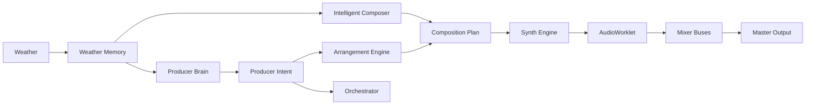

# Producer Brain Architecture (Phase 7)

Wind Composer's musical decision layer sits between weather interpretation and low-level audio generation.

## Decision cadence

| Boundary | Responsibility |
|----------|----------------|
| Beat | Micro-performance (ghost hats, accents) |
| Bar | Groove variation, bass pattern |
| 4 bars | Fills, hat layers, pad reduction |
| 8 bars | Musical evaluation, section hints, builds |
| 16–32 bars | Major structural transitions |

## Core modules

- `producerBrain.ts` — orchestrates intent, actions, drum/bass pattern selection
- `producerTypes.ts` — `ProducerIntent`, `MusicalEvaluation`, actions
- `musicalEvaluator.ts` — heuristic scores (density, clarity, noise risk)
- `tensionEngine.ts` — tension with mandatory release
- `noveltyManager.ts` — surprise cooldowns and repetition limits
- `deepHouseGroove.ts` — Deep House reference patterns and mix limits

## Producer Intent

Weather and user controls produce **targets**. The brain **smooths** toward them rather than jumping parameters instantly.

Key outputs: `energyTarget`, `rhythmicDensity`, `bassActivity`, `padGainLimit`, `atmosphereLimit`, `sidechainAmount`, `targetBpm`, `allowPads`, `allowLeads`.

## Anti-wash rules

For dance styles, orchestration caps pad and atmosphere gain from producer intent. Reverb is limited when drums are active. Startup introduces kick → bass → hats → pads in phases.
