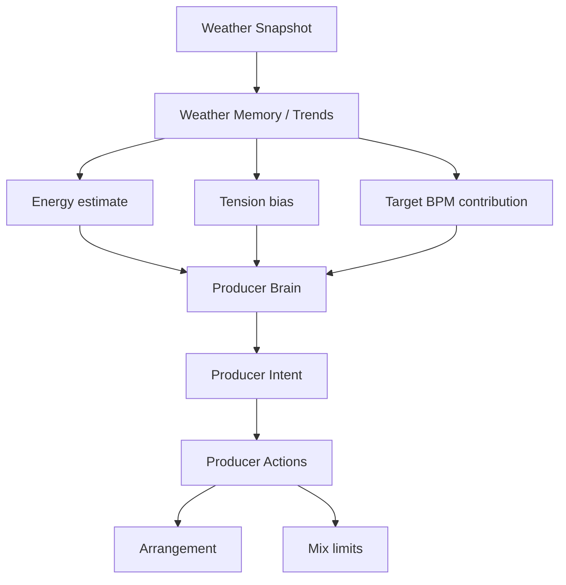

# Weather to Music Model

Weather does **not** map 1:1 to synth parameters.

## Influences

| Weather signal | Musical interpretation |
|----------------|------------------------|
| Rising wind | Higher energy target, more hat density, fill probability |
| Falling pressure | Rising tension, longer builds |
| Gust | One-shot fill/flourish (quantized), temporary BPM boost decay |
| High humidity | More sustained harmony, less sharp percussion |
| Storm likelihood | Build/drop bias, tension cap with release |

## User control: Weather Influence

- **Subtle** — slow mood drift
- **Balanced** — noticeable but genre-dominant (default)
- **Strong** — stronger energy/tension/BPM targets; groove still protected

## Between updates

Music continues evolving via producer evaluation every 8 bars. Composition never waits for API refresh.
