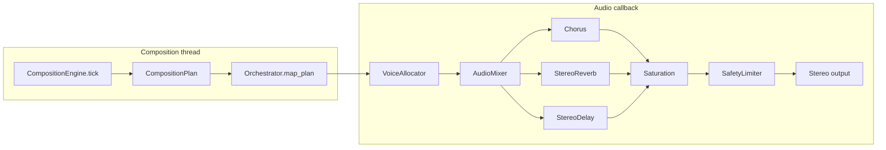

# Wind Composer — Audio Architecture (Phase 4)

Cinematic polyphonic synthesis interprets `CompositionPlan` decisions from the composition engine. Musical structure is not re-composed inside the audio callback.

## Signal flow



## Layer architecture

Twelve layer buses: `main_pad`, `secondary_pad`, `atmosphere`, `sub_bass`, `soft_bass`, `lead`, `bell`, `arpeggio`, `choir`, `noise_atmo`, `percussion`, `impact`.

Composition state and weather personality choose which layers are active via `Orchestrator` gain targets. Layers crossfade smoothly through `ParamSmoother` on the mixer.

## Voice allocation

- Pool size depends on quality: Low 16, Standard 28, High 32 voices.
- Reuse active voices on same note/layer.
- Steal quietest releasing voice when pool is full.
- Per-voice ADSR, filter, and unison oscillators.

## Preset system

Instrument presets live in `audio/preset_manager.py` (built-in) with optional JSON extension via `PresetManager`. Each preset defines oscillators, envelope, filter, sends, depth, and energy response.

Soundscape presets (`Natural Ambient`, `Deep Space`, etc.) bias reverb profile, warmth, and width without replacing weather-driven composition.

## Modulation routing

Slow LFO and smooth random drift modulate pitch subtly on voices. Weather and phrase energy influence orchestration brightness and layer gains outside the audio callback.

## Effects chain

Per-layer reverb and delay sends → master chorus → soft saturation → safety limiter. Bass layers use low reverb send; atmosphere layers use higher spatial send.

## Gain staging

`AudioMixer` applies per-layer gain with dynamic compensation: `1 / sqrt(active_layers)` to avoid level buildup when many layers play.

## Quality settings

| Level | Voices | Notes |
|-------|--------|-------|
| Low | 16 | Reduced unison, CPU protection fallback |
| Standard | 28 | Default |
| High | 32 | Richer unison |

Quality does not alter composition decisions.

## Real-time restrictions

Inside `_output_callback`:

- No file/network access
- No composition ticks
- No verbose logging
- Pre-scheduled rhythm events consumed from `_pending_rhythm_events`

## Composition → audio events

`MusicEngine._update_from_composition` calls `SynthEngine.apply_composition_plan(plan)`, which:

1. Maps plan to `OrchestrationTargets`
2. Applies layer gains, presets, and effect profiles
3. Sustains pad/bass chords and triggers melody notes
4. Handles rare events via `trigger_impact`

## Adding a new instrument preset

1. Add an `InstrumentPreset` entry in `audio/preset_manager.py` via `_register(...)`.
2. Reference the name in `MOOD_PRESET_BIAS` or orchestration defaults in `audio/orchestration.py`.
3. Ensure `layer` matches a `LAYER_IDS` entry in `audio_mixer.py`.

## Adding a new soundscape preset

1. Add entry to `SOUNDSCAPE_MAP` in `audio/orchestration.py`.
2. Add name to `SOUNDSCAPE_PRESETS` in `config.py` and `preset_manager.py`.
3. Optionally add reverb profile in `audio/reverb.py`.

## Deterministic audio tests

```bash
cd wind-composer
python3 test_audio.py
python3 -c "from audio.deterministic import render_all_references; render_all_references()"
```

Reference WAV files are written to `test-output/` (gitignored). Same seed and configuration produce identical output.

## Fallback path

Set `SynthEngine.set_use_cinematic(False)` to use the legacy four-layer monophonic synth with `EffectsChain` mono-to-stereo processing.
